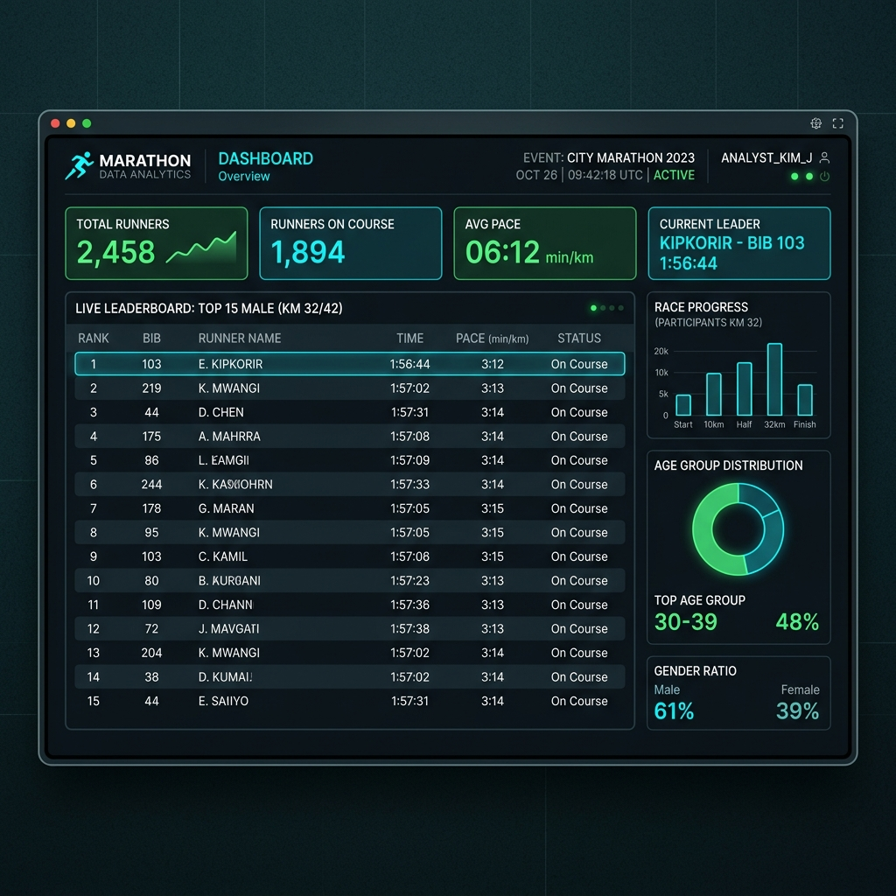

# Techcombank HCMC Marathon 2025 - Data Analysis


 
Hệ thống lưu trữ, phân tích và tra cứu thành tích vận động viên giải Techcombank HCMC Marathon 2025. Dự án được xây dựng với kiến trúc chặt chẽ sử dụng Python và cơ sở dữ liệu MySQL, áp dụng các thuật toán chuẩn xác để sinh và xử lý dữ liệu.

## Các Tính Năng Cốt Lõi

1. **Thuật Toán Phân Phối Chuẩn (Gaussian/Normal Distribution)**
   - Hệ thống tự động sinh ra hàng vạn dữ liệu thời gian chạy hoàn toàn ngẫu nhiên nhưng sát với thực tế, dựa trên trung bình và độ lệch chuẩn của từng cự ly.
   - Sắp xếp và tính toán thứ hạng (Rank) cực kỳ nhanh chóng.

2. **Dữ Liệu Khổng Lồ (Trên 11.000 VĐV)**
   - Khởi tạo ngẫu nhiên Họ & Tên Tiếng Việt cho từng vận động viên (Ví dụ: Nguyễn Văn An, Lê Thị Hoa...).
   - Quản lý quy tắc đầu số BIB nghiêm ngặt (Ví dụ: BIB cự ly 5km bắt đầu bằng số `5`, cự ly 21km bắt đầu bằng `21`). Tất cả BIB bắt buộc chuẩn hóa 5 chữ số.

3. **Giao Diện Tra Cứu (CLI Interactive Menu)**
   - Hệ thống tra cứu cực kỳ nghiêm túc (Formal), không sử dụng biểu tượng cảm xúc.
   - Trả về thông tin: Số BIB, Họ và Tên, Cự ly, Thời gian, và Thứ hạng.
   - Bắt lỗi đầu vào chặt chẽ (từ chối mã BIB sai định dạng hoặc không tồn tại).

## Ví Dụ Kết Quả Tra Cứu

Giao diện khi bạn nhập một mã BIB hợp lệ để tìm kiếm:

```text
--- TRÌNH TRA CỨU KẾT QUẢ ---
Nhập số BIB (Gõ 'q' để thoát): 42010

KẾT QUẢ TRA CỨU:
Số BIB     : 42010
Họ và Tên  : Trần Văn Tuấn
Cự ly      : 42.195km
Thời gian  : 04:12:35
Thứ hạng   : 145 / 850
```

## Bảng Dữ Liệu Tóm Tắt (Mô phỏng)

Dưới đây là một phần dữ liệu phân bổ theo cự ly đang được lưu trong MySQL:

| Cự ly | Đăng ký | Hoàn thành | Tỷ lệ hoàn thành (%) | Khoảng BIB |
| :--- | :--- | :--- | :--- | :--- |
| 5km | 4500 | 4410 | 98.00% | 50000 - 59999 |
| 10km | 5200 | 4940 | 95.00% | 10000 - 19999 |
| 21.1km | 950 | 920 | 96.84% | 21000 - 21999 |
| 42.195km | 900 | 850 | 94.44% | 42000 - 42999 |

## Cấu Trúc Dự Án (Project Structure)

```plaintext
├── main.py             # File thực thi chính của ứng dụng
├── database.py         # Chứa logic kết nối và tương tác với cơ sở dữ liệu MySQL
├── generator.py        # Các hàm tự động sinh dữ liệu thời gian, BIB và Tên ngẫu nhiên
├── config.py           # Cấu hình hệ thống (Database thông tin đăng nhập, v.v.)
├── requirements.txt    # Danh sách các thư viện Python cần thiết
├── setup.sh            # Script hỗ trợ thiết lập môi trường
└── README.md           # Tài liệu hướng dẫn dự án
```

## Cấu Trúc Cơ Sở Dữ Liệu (Database Schema)

Dưới đây là cấu trúc các bảng dữ liệu (được định nghĩa trong `database.py`) thể hiện thiết kế cơ sở dữ liệu của dự án:

```sql
-- Bảng thống kê tỷ lệ hoàn thành theo cự ly
CREATE TABLE IF NOT EXISTS marathon_stats (
    id INT AUTO_INCREMENT PRIMARY KEY,
    distance VARCHAR(20) NOT NULL,
    registered_runners INT NOT NULL,
    finished_runners INT NOT NULL,
    completion_rate DECIMAL(5, 2) NOT NULL
);

-- Bảng chi tiết thành tích vận động viên
CREATE TABLE runner_details (
    bib_number VARCHAR(10) PRIMARY KEY,
    runner_name VARCHAR(100) NOT NULL,
    distance VARCHAR(20) NOT NULL,
    finishing_time VARCHAR(10) NOT NULL,
    rank_position INT NOT NULL,
    total_runners INT NOT NULL
);
```

## Hướng Dẫn Sử Dụng

1. **Cài đặt thư viện:**
   ```bash
   pip3 install -r requirements.txt
   ```
2. **Khởi chạy hệ thống:**
   ```bash
   python3 main.py
   ```
   Hệ thống sẽ tự động quét cơ sở dữ liệu. Nếu phát hiện bảng dữ liệu chưa có tên vận động viên, hệ thống sẽ tự động xóa bảng cũ và tái tạo (re-generate) toàn bộ dữ liệu mới kèm tên Tiếng Việt.
